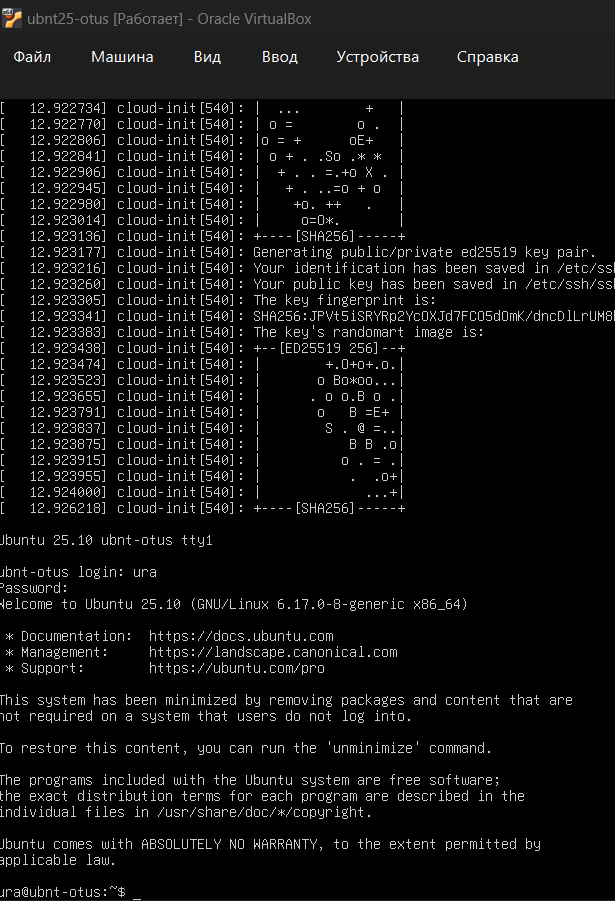
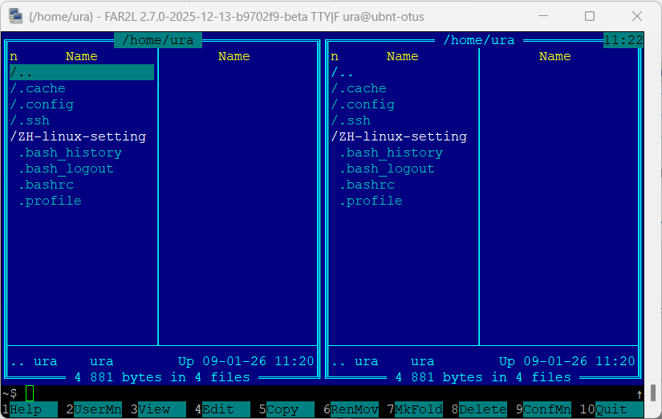
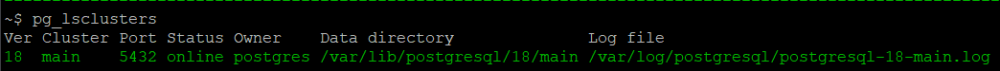
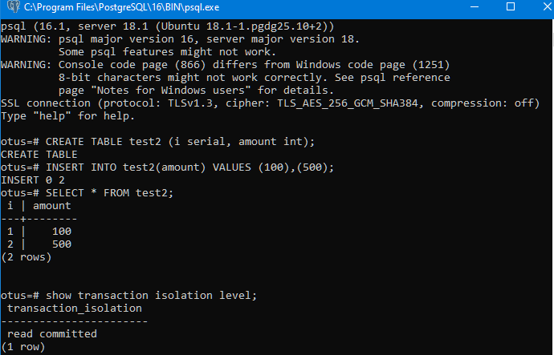
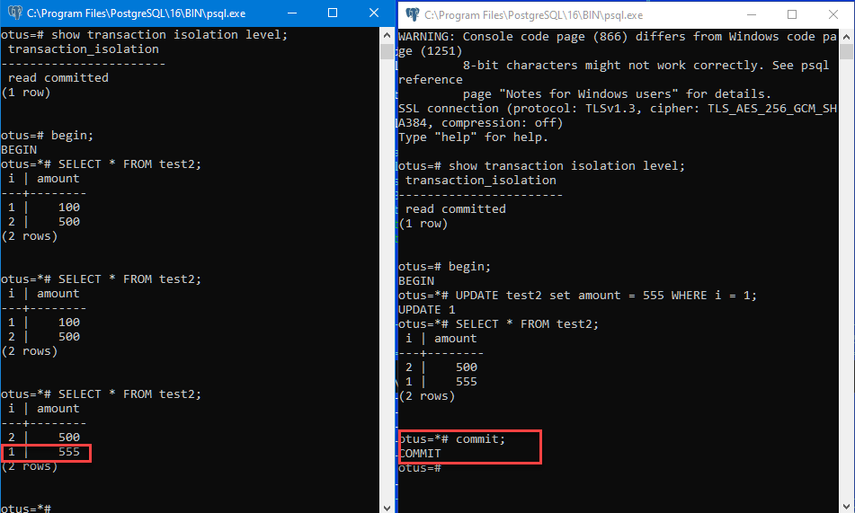
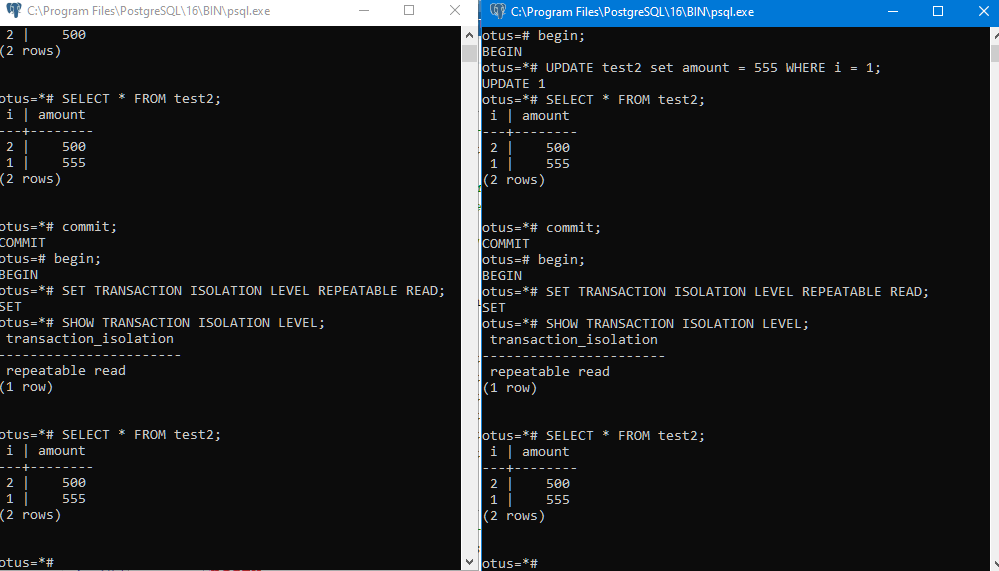
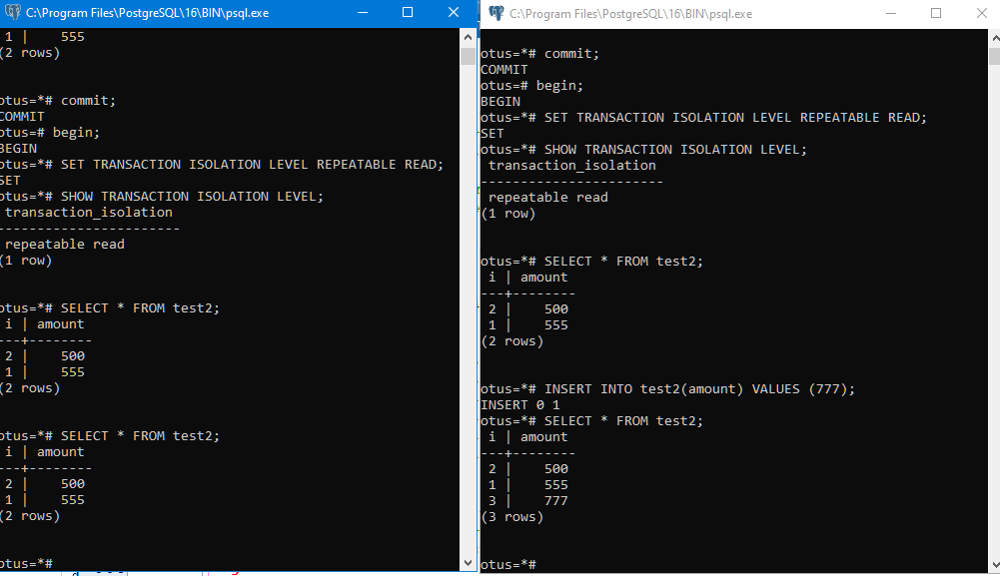
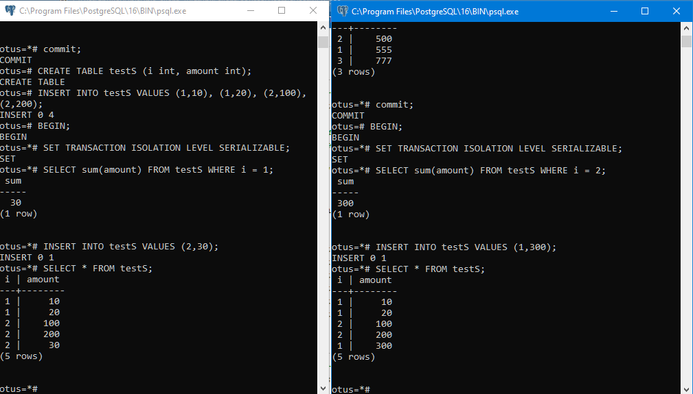
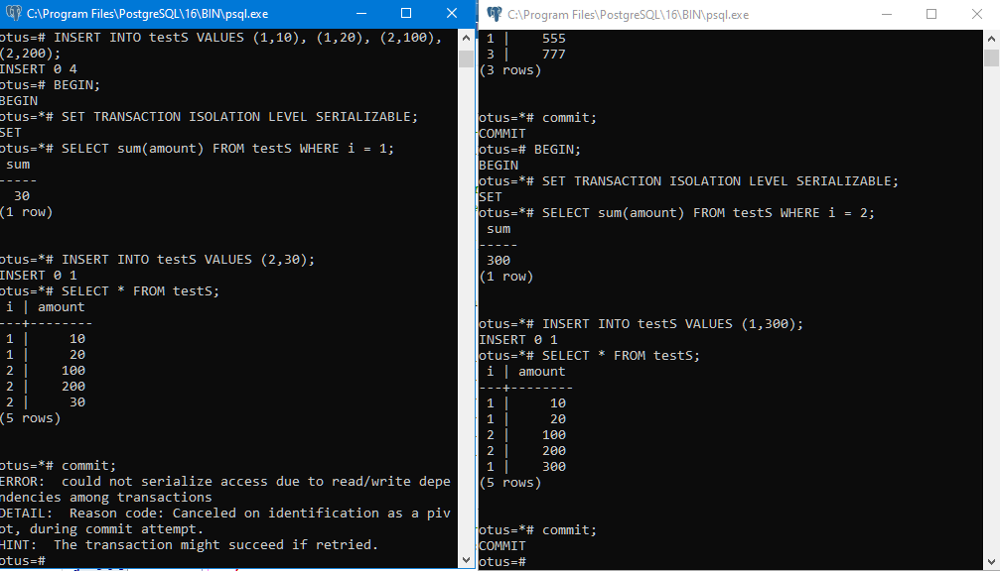

Отчет по домашнему заданию "Введение в PostgreSQL в облаках: технологии для современных DBA"


#  1. Ставим на VirtualBox 7.2 Ubuntu Server 25.10




 # 2. Настраиваем подключение SSH и обновляемся

настраиваем ssh клиент kitty


подключаемся по ssh и обновляемся

```bash
sudo apt update && sudo apt upgrade -y
```


 # 3. Ставим последню версю far2l


```bash
sudo apt install -y software-properties-common # required if add-apt-repository not installed
sudo add-apt-repository ppa:far2l-team/ppa  # добавляем репозиторий
sudo apt install -y far2lfar
```




# 4. Ставим postgresql 18


```
sudo apt install -y postgresql-common
sudo /usr/share/postgresql-common/pgdg/apt.postgresql.org.sh
sudo apt update
sudo apt install -y postgresql-18
```

Проверяем что поставилось

```
pg_lsclusters
```

pg_lsclusters



правим файлы

```bash
sudo far2l -e /etc/postgresql/18/main/postgresql.conf
```
```config
#listen_addresses = 'localhost'
listen_addresses = '*'
```


```bash
sudo far2l -e /etc/postgresql/18/main/pg_hba.conf
```
Разрешаем вход по ключу и паролю
```
host    all             all             0.0.0.0/0               scram-sha-256
```

Перестартуем, чтобы взялись настройки

```bash
sudo pg_ctlcluster 18 main restart
```


Сбрасываем пароль postgresq

```
sudo -u postgres psql

-----

Установить пароль для Postgres:
\password   #12345
\q
```

подключаемся к базе postgres по паролю из windows


```cmd
SET PGPASSWORD=123
SET PGDATABASE=postgres
SET PGHOST=ubnt-otus
SET PGUSER=postgres
SET PG_ROOT=C:\Program Files\PostgreSQL\16
SET PGPORT=5432

SET LANG=en_US.UTF-8
SET PGCLIENTENCODING=UTF8
SET PATH=%PG_ROOT%\BIN;%PATH%

psql -U postgres
```


# 5. Уровни изоляции


Создаем БД для экспериментов

```
CREATE DATABASE otus;
```

Переодключаемся к БД otus, создаем таблицу с данным



## 5.1 Read Commited

Заупускаем две сессии, в них транцзацкии и убеждаемся что первая сессия не видит не закомиченных данных


Но если закомитеть вторую сессия, то данные в пероый становятся видны



## 5.2 Repeatable Read

Отыкрывает две транзации с уровоне **repeatable read**



Во втрой транзакции вставляем данные и убеждаемся что первая транзакция этих данных не видит:



После commit во вотрой транзации первая сессия все также не видит данных:


## 5.3 SERIALIZABLE

Подготваливаем данные, открываем две транзакции, обновнялем в обоих транзациция, и убежадемся, что они видият разные данные: 



Комитим данные во второй сессии, а потом в первой и видим сообщение об ошибке:


