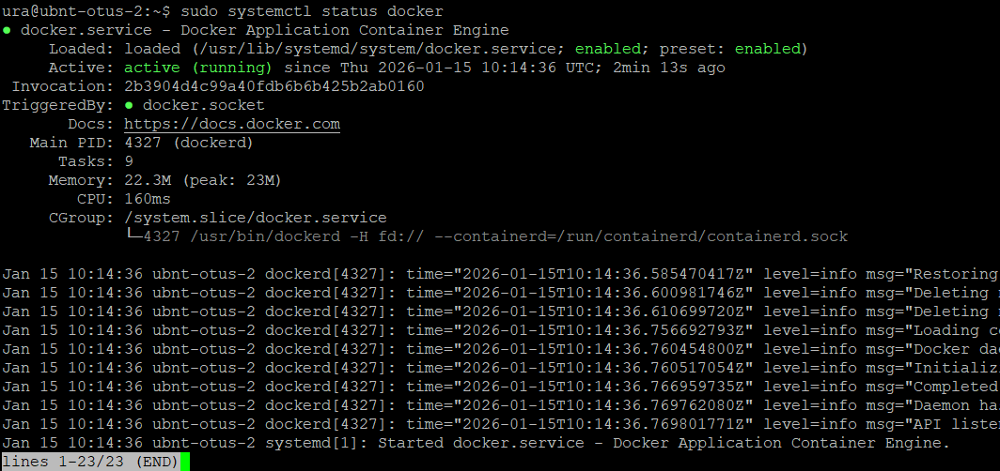
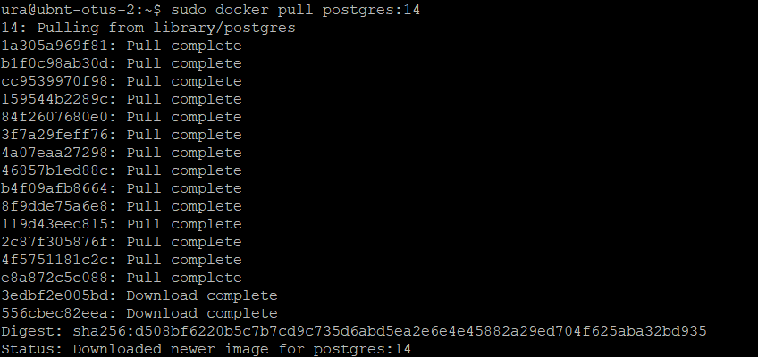
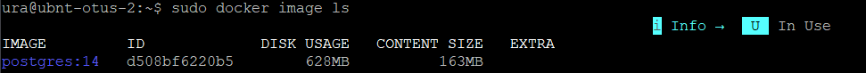
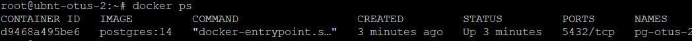
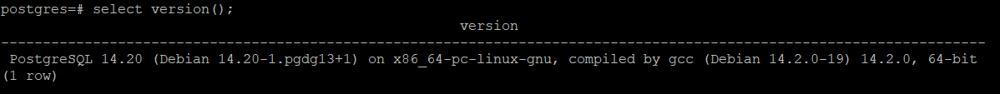
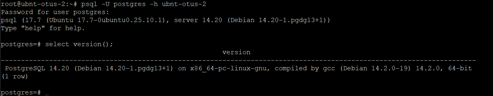

Отчет по домашнему заданию "PostgreSQL и Docker: создание образов, настройка и мониторинг"

Версия с VirtualBox

# 1. Ставим на VirtualBox 7.2 Ubuntu Server 25.10


# 2. Ставим docker

```bash
# Add Docker's official GPG key:
sudo apt update
sudo apt install ca-certificates curl
sudo install -m 0755 -d /etc/apt/keyrings
sudo curl -fsSL https://download.docker.com/linux/ubuntu/gpg -o /etc/apt/keyrings/docker.asc
sudo chmod a+r /etc/apt/keyrings/docker.asc

# Add the repository to Apt sources:
sudo tee /etc/apt/sources.list.d/docker.sources <<EOF
Types: deb
URIs: https://download.docker.com/linux/ubuntu
Suites: $(. /etc/os-release && echo "${UBUNTU_CODENAME:-$VERSION_CODENAME}")
Components: stable
Signed-By: /etc/apt/keyrings/docker.asc
EOF

sudo apt update
```

```bash
sudo apt install docker-ce docker-ce-cli containerd.io docker-buildx-plugin docker-compose-plugin

```

```bash
sudo systemctl status docker
```



# 3. Ставим docker postgresql-14

Получаем образ в локальную систему

```bash
sudo docker pull postgres:14
```




Убеждаемся  что образ есть 

```bash
sudo docker image ls
```


Запускаем контейнер с именем **pg-otus-2** из образа **postgres:14**

```bash
docker run --name pg-otus-2 -e POSTGRES_PASSWORD=p123 postgres:14
```


и проверяем что он запстился:

```bash
docker ps
```



# 4. Подключение к конейнеру postgresql

## 4.1. Поключение из котейнера

```bash
docker exec -it pg-otus-2 psql -U postgres
```




## 4.2. Подключение из хост ОС

Пересоздаем с пробросом порта 5432

```bash
docker rm --force pg-otus-2

docker run --name pg-otus-2 -e POSTGRES_PASSWORD=p123 -p 5432:5432 postgres:14
```

ставим на хост компьютер postgresql-client


```bash
sudo apt install postgresql-client
```

Подключаемся с хоста

```BASH
psql -U postgres -h ubnt-otus-2 
```




# 5. Docker контейнер с хранением данных на хост системе

```bash
 

```

```bash
docker rm --force pg-otus-2
```

создаем новый контейнер

```bash
docker run --name pg-otus-2-1 -e POSTGRES_PASSWORD=p123 -p 5432:5432 -v pg_data:/var/lib/postgresql/data -d postgres:14
```

Подключаемся из хостовой машины

```
psql -U postgres -h ubnt-otus-2
```

создаем таблицу и наполняем ее данными


```sql
create table shipments(id serial, product_name text, quantity int, destination text);

insert into shipments(product_name, quantity, destination) values('bananas', 1000, 'Europe');
insert into shipments(product_name, quantity, destination) values('bananas', 1500, 'Asia');
insert into shipments(product_name, quantity, destination) values('bananas', 2000, 'Africa');
insert into shipments(product_name, quantity, destination) values('coffee', 500, 'USA');
insert into shipments(product_name, quantity, destination) values('coffee', 700, 'Canada');
insert into shipments(product_name, quantity, destination) values('coffee', 300, 'Japan');
insert into shipments(product_name, quantity, destination) values('sugar', 1000, 'Europe');
insert into shipments(product_name, quantity, destination) values('sugar', 800, 'Asia');
insert into shipments(product_name, quantity, destination) values('sugar', 600, 'Africa');
insert into shipments(product_name, quantity, destination) values('sugar', 400, 'USA');
```

смотрим идентификатор нашего контейнера

```
docker ps -a
```

затем  останавливаем,  и удаляем

```
docker stop 9de9621de2b5

docker rm 9de9621de2b5
```

убеждаемся что контейнер удалел

docker ps -a


Создаем контейнер занаво

```
docker run --name pg-otus-2-1 -e POSTGRES_PASSWORD=p123 -p 5432:5432 -v pg_data:/var/lib/postgresql/data -d postgres:14
```

подключаемсмя хост компьютера через psq и убеждаемся что данные на месте


Задание выполнено
